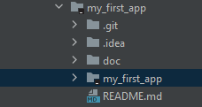
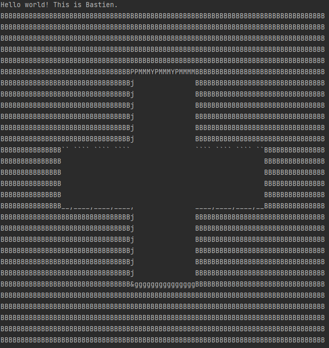

# First Assignment

## Introduction
Below are the instructions for this first assignment/mini-projet. The commands to execute are not explicitly mentioned but you should be able to find those informations online (such as how to git clone a project). Toward the end of the project, you will need to do more research to achieve the goals.

## Execution
This is an individual assignment, questions at the end of the assignment must be done individually. You can help each other in case you have issues in understanding but you must execute all actions indivudally.
You can reach out for help to your respective manager or to me directly.

## Prerequisites to install
- git bash
- IntelliJ Community Edition
- Docker (on Windows or on WSL if you have it)
- Java JDK 20 + Configure Windows "PATH"

### Optional
- WSL (Ubuntu integrated in Windows and can be used as a terminal)

## Setup
1. Fork this project (top right corner of the page)
2. Go to the newly created project, from your personal account.
3. Clone it to your local laptop

## Run your application
1. Open the project from IntelliJ by selecting the nested my_first_app folder as shown on this screenshot :

2. Go to File -> Project Structure -> Project Settings - Project -> SDK : Select Oracle OpenJDK version 20
3. Run MyApp
3. Check that you see a message "Hello World!" in the intellij console

## First push
### Setup github authentication 
You have two options to authenticate when pushing a change to your repository :
- SSH Authentication
    1. Generate a key pair : https://docs.github.com/en/authentication/connecting-to-github-with-ssh/generating-a-new-ssh-key-and-adding-it-to-the-ssh-agent
    2. Add the public key (.pub file) to your Github ssh keys: https://docs.github.com/en/authentication/connecting-to-github-with-ssh/adding-a-new-ssh-key-to-your-github-account
    3. Test your setup : https://docs.github.com/en/authentication/connecting-to-github-with-ssh/testing-your-ssh-connection
    4. When pushing change, your ssh key will be automatically use to authenticate to your repo
- Token authentication
    1. Generate a token from https://github.com/settings/tokens
    2. Use is as a password when pushing change to your repo
### Push
1. Add your first name to the "Hello World!" message, for example : "Hello World! This is Bastien".
2. Push the new change to your personal repository
    - Use an explicit commit message (for example "Customize Hello World message" and not "my commit")

## Make your project a maven and make a jar
1. Follow https://www.jetbrains.com/help/idea/convert-a-regular-project-into-a-maven-project.html
    - If you encounter some issues during the procedure, try restarting IntelliJ IDEA.
2. Generate the jar (as mentioned in the procedure)
2. Execute your generated jar from the terminal (cmd or other), check that "Hello World" is displayed

 ## Build a docker running your code
 1. Build a docker image that will run your code, include your first name in the docker image.
 2. Run a docker container from that image
 3. Check that "Hello World" is displayed

## Add functionnalities to your code
1. Include this lib through maven : https://mvnrepository.com/artifact/org.alcibiade/asciiart-core
2. Add code to convert a picture of your choice into ASCII character. For example I used the swiss flag and I got this output :

3. Make a jar and run the jar to see if you have the same output. Check that link below to generate a jar which includes the maven dependencies :
 https://stackoverflow.com/questions/574594/how-can-i-create-an-executable-runnable-jar-with-dependencies-using-maven

 ## Export the docker image with the new code
 1. Re-build a docker image with the latest jar you have created
 2. Export your docker image in a file
 3. Send it to another person of your choice, i.e. through Discord
 4. Ask that person to run it, and compare the behavior of your container locally and the one running on your partner. The behavior should be the same.

 ## Deliverable
 At the end of the README.md, add this following element :
 - A screenshot of your docker image and docker running (from the command line)
 - A screenshot of your app output
 - Answer to those questions :
    - What is the prerequisite for another machine to run your application if you provide it the docker image ?
        - In term of Operating System, pre-installed app, etc...
    - What is the difference between a virtual machine and a docker container ?
- Refer to https://www.markdownguide.org/basic-syntax/ to learn about markdown syntax (ie. how to include pictures)
### Deadline
Send me your git repo link on discord through direct message by **Friday, 21th April, 5pm**.
